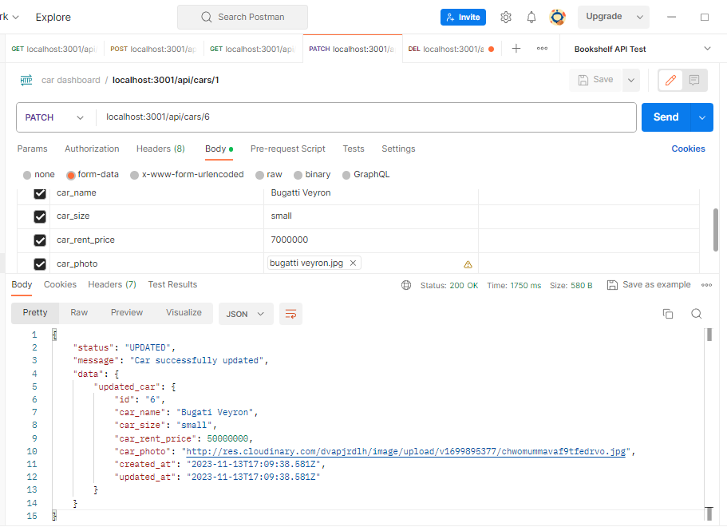

# Flow endpoint

**4 layers:**
1. Router: done
2. Handler: done
3. Service (Usecase): done
4. Repository (Save/Get to/from the Database): done

---

## Migration

1. Create a migration for the "cars" table:

   npx knex migrate:make create_cars_table

2. Run the migration:

   npx knex migrate:up

## Endpoints

1. **Get all cars:**
   - http://localhost:3001/api/cars
   

2. **Get car by id:**
   - http://localhost:3001/api/cars/:id
   

3. **Get car by size category:**
   - http://localhost:3001/api/category/:size
   

4. **Upload car (POST):**
   - http://localhost:3001/api/cars
   - **Body Parameters:**
     - car_name (string)
     - car_size (string)
     - car_rent_price (int)
     - car_photo (file)
   -

5. **Update car by id (PATCH):**
   - http://localhost:3001/api/cars/:id
   - **Body Parameters:**
     - car_name (string)
     - car_size (string)
     - car_rent_price (int)
     - car_photo (file)
   - 

6. **Delete car by id (DELETE):**
   - http://localhost:3001/api/cars/:id
   

## PGADMIN

